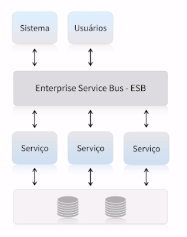
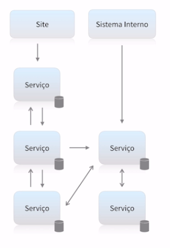

# Introdução aos microserviços

## O que é um serviço?

- Disponibiliza informação;
- Realizações transações
- Resolve problemas de negócio
- Independente de tecnologia ou produto
- Pode estabelecer comunicação com diversos "clientes"

## SOA: Arquitetura Orientada a Serviços

- Serviços normalmente maiores baseados em funcionalidades
- Necessidade de ESB
- Single point of failure
- Compartilhamento de banco de dados é comum
- Muitas vezes também podem ter sistemas monolíticos sendo utilizados como serviçios

## Arquitetura baseada em Microserviços

- Serviços pequenos com poucas responsabilidades
- Maior tolerância a falhas
- Totalmente independetes
- Cada serviço possui seu próprio banco de dados
- Comunicação síncrona ou assíncrona

## Não são para todas as situações

- Arquitetura complexa
- Custo mais elevado
- Necessidade de mais equipes para manter
- Sistema precisa ser grande o suficiente para justificar
- Gera problemas que normalmente você não tinha antes
- Monitoramento complexo

**Microserviços não são moda, mas sim necessidade**

## Principais características

Caracteristicas definidas por Martin Fowler, que separou 9 caracteriscticas principais de arquiteturas baseadas em microserviços.

### Componentização via serviços

- Services dos microserviços != Services da OO
- Componente é uma unidade de software independente que pode ser substituida ou atualizada.

**Desvantagens**

- Chamadas externas são mais custosas do que chamadas locais.
- Cruzamento entre componentes pode se tornar complexo.
- Transações entre servios são "grandes desafios".
- Mudanças bruscas em regras de negócio podem afetar diversos serviços tornando o processo difícil de ser refeito.

#### Organização em torno do negócio

Um projeto é baseado em um ou mais produtos que trabalham em diferentes contextos.

- Time de desenvolvedores por produto.
- Muitas empresas tratam os times como "squads".
- Cada squad é multidisciplinar.
- Cada squad é responsável por um ou mais produtos.
- Cada produto pode ter um ou mais serviços envolvidos.

#### Estrutura baseada em produtos e não em projetos

#### Smart endpoints e Dumb pipes

- Exposição de APIs (ex: Rest)
- Comunicação entre serviços
- Comunicação síncrona e assíncrona
- Utilização de sistemas de mensageria (ex: RabitMQ)
- Garantia de que um serviço foi executado baseado na execução das filas

#### Governança descentralizada

- Ferramenta certa para o trabalho certo. Tecnologias podem ser definidas baseadas na necessidade do produto.
- Diferentes padrões entre squads
- Contratos de interface de forma independente

#### Descentralização no gerenciamento de dados

#### Automação de infraestrutura

- Cloud computing
- Testes automatizados
- Continuous delivery
- Continuous integration
- Load balancer / Autoscaling

#### Desenhado para falhar

- Tolerância a falha
- Serviços que se comunicam precisam de fallback
- Logging
- Monitoramento em tempo real
- Alarmes

#### Design evolutivo

- Produtos bem definidos podem evoluir ou serem extintos por razões de negócio
- Gerenciamento de versões
- Replacement and upgradeability