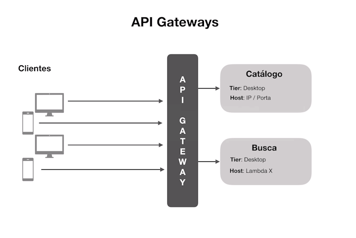
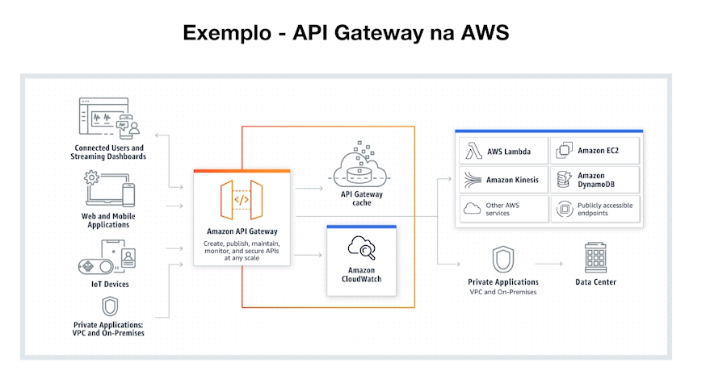
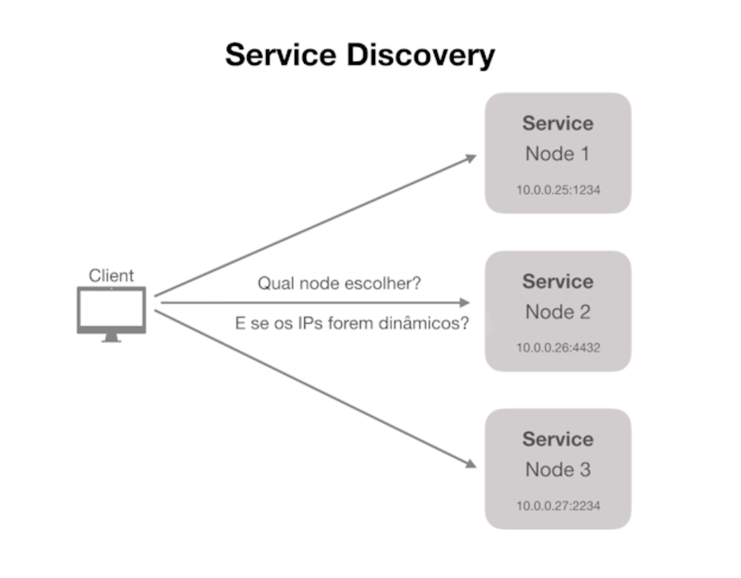
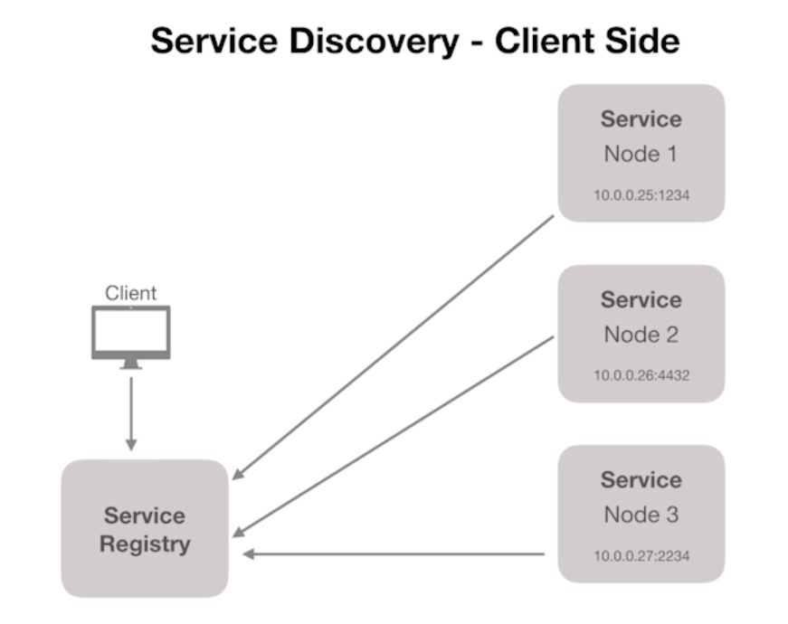
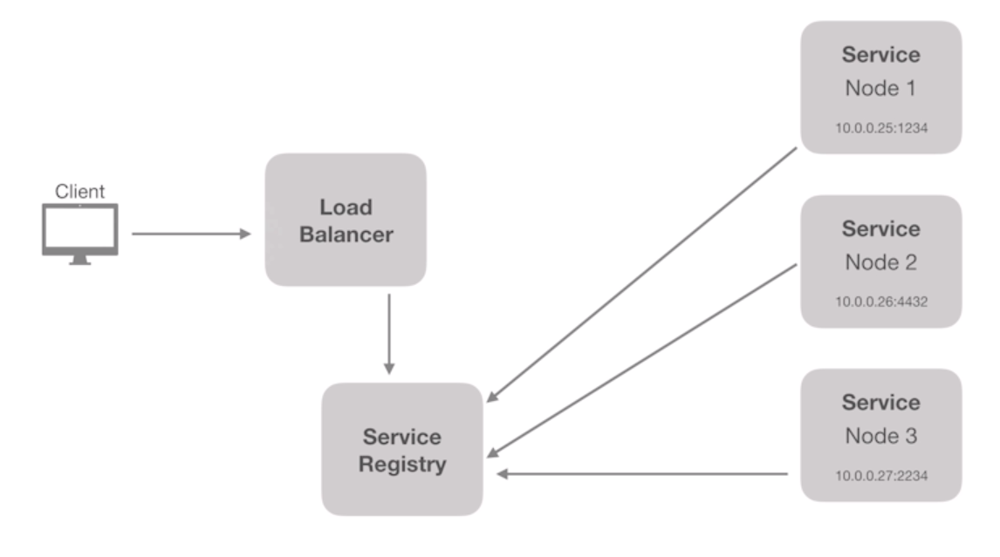

# API Gateways

"Uma API gateway recebe todas as chamadas de APIs dos clientes e então as roteia para os microserviços correspondentes..." (nginx.com)

Em alguns casos ela também é responsável por realizar processos de verificação de segurança, como autenticação e autorização.

---

---

## Service Discovery

O processo de service discovery é responsável por prover mecanismos de identificação dos serviços disponíveis e suas instâncias.

---

---

#### Server side

