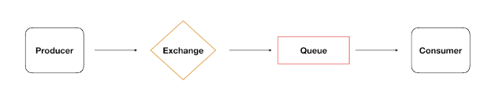
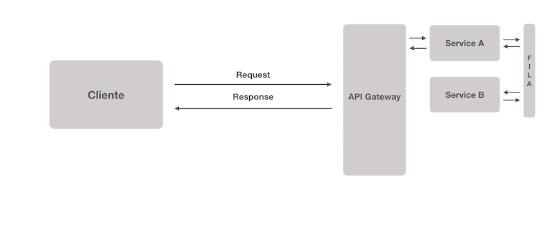

# Comunicação entre microserviços

Existem comunicações *síncronas* e *assíncronas*. Numa comunicação síncrona, operações que demandam muito processamento do servidor podem travar nosso sistema. Para resolver esse problema podemos usar um serviço de mensageria para estabelecer a comunicação entre dois serviços. Dessa forma as mensagens ficam em fila esperando serem processadas e não travam nenhum sistema. Serviços de mensageria também garante a entregabilidade da mensagem.

## RabbitMQ

- Message Broker (intermediador de mensagens)
- Implementa AMQP (Advanced Message Queuing Protocol)
- Producers <=> Brokers <=> Consumers
- Desacoplamento entre serviços
- Rápido e Poderoso
- Padrão de Mercado

#### Mecanismos de filas

A mensagem passa por um *Exchange* que adiciona a mensagem à fila correta.

O producer gera a mensagem com uma *routing-key* que o exchange correlaciona com uma *binding-key* que aponta pra qual fila a mensagem deve ser enviada.

## Dupla Latência

Como a informação pode necessitar transitar em diferentes serviços, isos pode gerar uma demora maior no processo. Monolítos são bem mais rápidos nesse aspecto.

