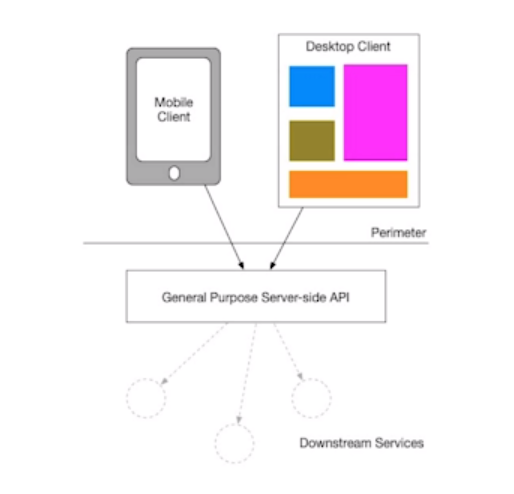
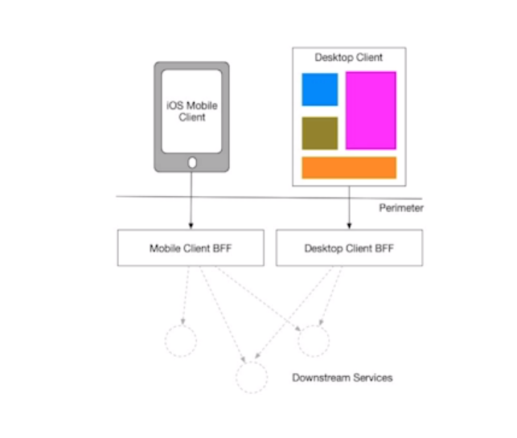

# Backend for Frontend (BFF)

A ideia é que diferentes clientes tem diferentes poderes de processamento e memória, então a resposta de um backend pra um cliente mobile seria diferente para um cliente web, um device IoT, etc. 

Dessa forma, o backend teria resposta mais rápidas para um celular e consumiria menos processamento dele.

Read suggestion: [Pattern: Backends For Frontends](https://samnewman.io/patterns/architectural/bff/).