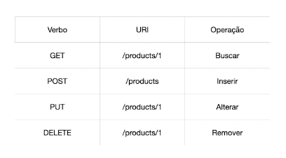
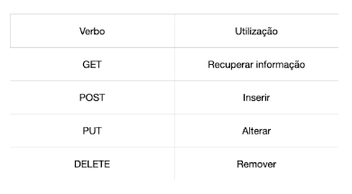
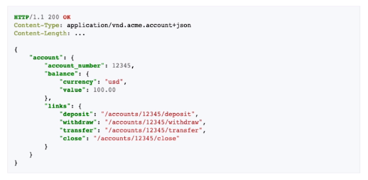
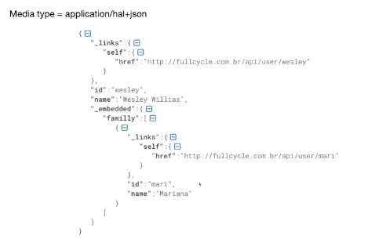

# REST

*Representational state of transfer*. Surgiu em 2000 por Roy Fielding em uma dissertação de dourorado. Ele é simples, stateless e pode ser cacheável.

### Níveis de maturidade (Richardson Maturity Model)

- Nível 0: The Swamp of POX. Tudo que vc acaba trafegando por HTTP, se realiza uma transação.

- Nível 1: Utilização de resources 

- Nível 2: Verbos HTTP. Utilizar o verbo certo pra operação correta.

- Nível 3: HATEOAS: Hypermedia as the Engine of Application State. O servidor vai responder a requisição e trazer o que mais podemos fazer com aquele recurso de conta.

## Uma boa API REST

- Utiliza URIs únicas para serviços e itens que são expostos para esses serviços
- Utiliza todos os verbos HTTP para realizar as operações em seus recursos, incluindo caching
-Provê links relacionais para os recursos exemplificando o que pdoe ser feito

## HAL, Collection+JSON e Siren

- JSON não provê um padrão de hipermídia para realizar a linkagem
- HAL: Hypermedia Application Language
- Siren

#### Hal

## Method Negotiation

HTTP possui um outro método: OPTIONS. Esse método nos permite informar quais métodos são permitidos ou não em determinado recurso.

**OPTIONS /api/product HTTP/1.1**
**Host: fullcycle.com.br**

Resposta pode ser :

**HTTP/1.1 200 OK**
**Allow: GET, POST**

Caso envie a requisição em outro formato:

**HTTP/1.1 405 Not Allowed**
**Allow: GET, POST**

## Content Negotiation

O processo de content negotiation é baseado na requisição que o client está fazendo para o server. Nesse caso ele solicita o que e como ele quer a resposta. O server então retornará ou não a informação no formato desejado.

#### Accept Negostiation

Client solicita a informação e o tipo de retorno pelo server baseado no media type informado por ordem de prioridade.

**GET /product**
**Accept: application/json**

Resposta pode ser o retorno dos dados ou:

**HTTP/1.1 406 Not Acceptable**

#### Content-Type Negotiation

Através de um content-type no header da request, o servidor consegue verificar se ele irá conseguir processar a informação para retornar a informação desejada.

**POST /PRODUCT HTTP/1.1**
**Accept: application/json**
**Content-Type:application/json**

**{**
  **"name": "Product 1"**
**}**

Caso o servidor não aceite o content type, ele poderá retornar:

**HTTP/1.1 415 Unsupported Media Type**