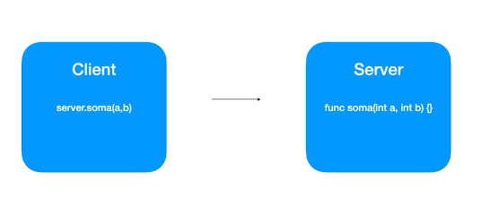
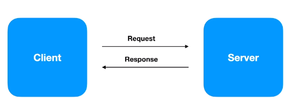
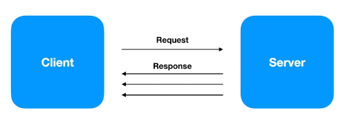
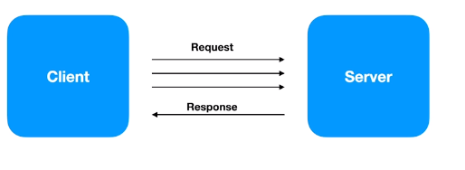
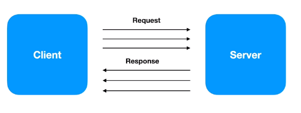

# gRPC

Framework desenvolvido pela Google que tom o objetivo de facilitar o processo de comunicação entre sistemas de uma forma extremamente rápida, leve, independente de linguagem.

Faz parte da CNCF (Cloud Native Computation Foundation)

### Em quais casos podemos utilizar?

- Ideal para microsserviços
- Mobile, Browsers e Backend
- Geração das bibliotecas de forma automática
- Streaming bidirecional utilizando HTTP/2


### Linguages (suporte oficial)

- gRPC-GO
- gRPC-JAVA
- gRPC-C
  - C++
  - Python
  - Ruby
  - Objective C
  - PHP
  - C#
  - Node.js
  - Dart
  - Kotlin / JVM

### Remote Procedure Call

Cliente chama uma função no servidor.



### Protocol Buffers

"Protocol buffers are Google's language-neutral, platform-neutral, extensble mechanism for serializing structured data - think XML, but smaller, faster and simples."

### Protocol Buffers x JSON

- Arquivos binários < JSON
- Processo de serialização é mais leve (CPU) do que JSON
- Gasta menos recursos de rede
- Processo é mais veloz

Exemplo de um arquivo *.proto*:

```
syntax = "proto3;

message SearchRequest {
  string query = 1;
  int32 page_number = 2;
  int32 result_per_page = 3;
}
```

### HTTP/2

Muito mais rápido que a versão 1 do HTTP

- Nome original criado pela Google era SPDY
- Lançado em 2015
- Dados trafegados são binários e não texto como no HTTP 1.1
- Utiliza a mesma coneção TCP para enviar e receber dados od cliente e do servidor (Multiplex)
- Server push
- Headers são comprimidos
- Gasta menos recursos de rede
- Processo é mais veloz


### gRPC - API "unary"



### gRPC - API "Server streaming"

É posśivel manter a conexão e mandar os dados aos poucos



### gRPC - API "Client streaming"

Cliente manda informações aos poucos e depois o servidor envia a resposta



### gRPC - API "Bi directional streaming"




### Rest vc gRPC

Atualmente o gRPC é usado mais para comunicação entre microserviços e não entre browser e servidor.

**Rest**

- Texto/JSON
- Unidirecional
- Alta latência
- Sem contrato (maior chance de erros)
- Sem suporte a streaming (Request / Response)
- Design pré-definido
- Bibliotecas de terceiros

**gRPC**

- Protocol Buffers
- Bidirecional e Assíncrono
- Baixa latência
- Contrato definido (.proto)
- Suporte a streaming
- Design é livre
- Geração de código

