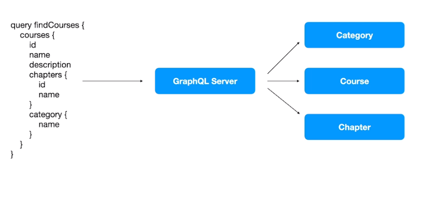

# GraphQL

Foi criado para que diferentes clientes possam buscar informações diferentes de uma entidade do servidor. Um cliente mobile e um desktop podem necessitar de dados diferentes, e pra isso o cliente tem, no GraphQL, autonomia para escolher quais dados ele gostaria de receber.

 ### Vantagens

 - Único endpoint (sem endpoints encadeados)
 - Única request
 - Server apresenta os recursos disoníveis
 - Client solicita somente a informação necessária
 - Há possibilidade de realizar alterações / inserções nos dados através de "mutations"
 - Trabalha utilizando Http
 - Retorna json como response

### Schema

 - GraphQL Schema Language
 - Data Types
 - Query
 - Mutations
 - Subscriptions (manda informações ao cliente quando houver mudanças no servidor)

 ### Funcionamento

 - Queries realizam consultas e trazem os dados de acordo com o solicitado. Executadas em paralelo.

- Mutation realiza processo de create, update e delete. É executado em série.

* Cuidar do problema com n+1 quando for fazer queries aninhadas no db