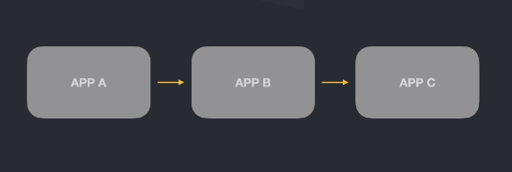
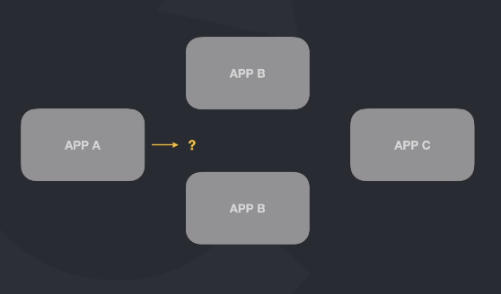

# Service Discovery e Consul

### Cenário comum em aplicações distribuidas

Porém se o serviço B escalar, como saber qual máquina acessa?

### Perguntas a se fazer
 
- Qual máquina chamar?
- Qual porta utilizar?
- Preciso saber o IP de cada instância?
- Como ter certeza se aquela instância está saudável?
- Como saber se tenho permissão para acessar?

## Service Discovery

- Descobre as máquinas disponíveis para acesso
- Segmentação de máquinas para garantir segurança
- Resolução via DNS
- Health check
- Como saber se tenho permissão para acessar

## Hashicorp Consul

- Service Discovery
- Service Segmentation
- Load Balancer na Borda (Layer 7)
- Key / Value Configuration (variáveis de ambiente)
- Opensource / Enterprise

**Importante**

Esse não é um modulo sobre Consul e sim para entendermos o processo de Service Discovery.